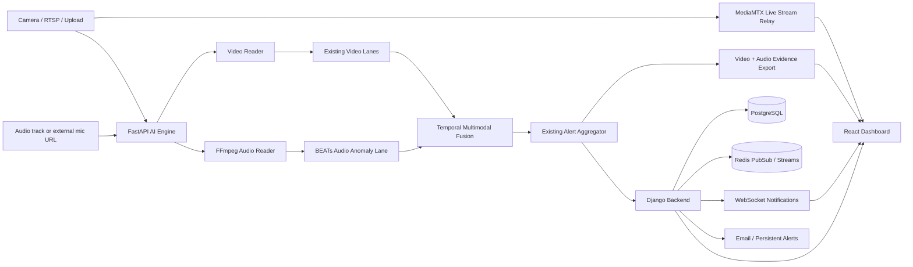
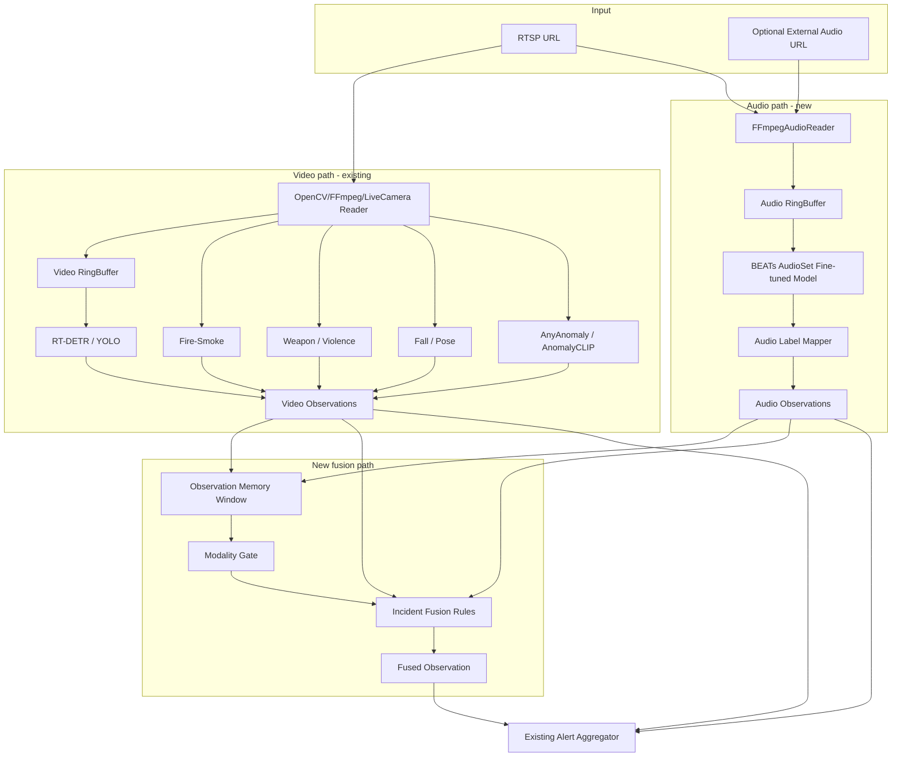
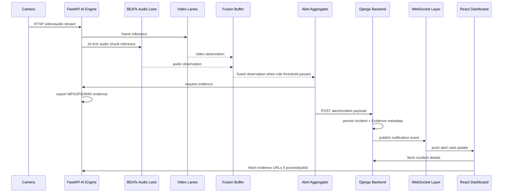
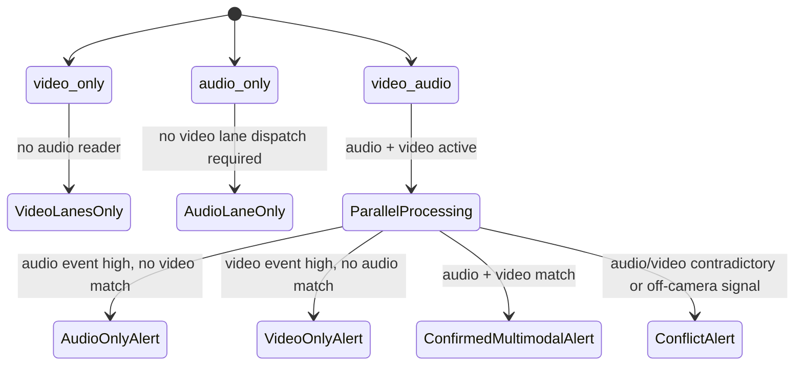
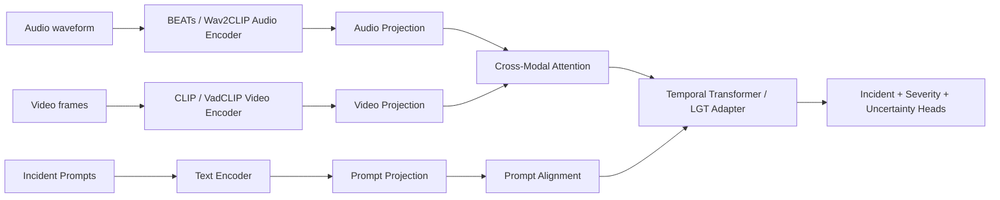

# VigilZone / 295A SOTA-Aligned Audio-Visual Implementation Plan

**Date:** 2026-05-09  
**Repository target:** `https://github.com/KasplatSnow/295A`  
**Purpose:** This file is the coding-agent implementation plan only. It contains the exact build order, files to add or modify, config contracts, model-weight instructions, backend/frontend/notification changes, deployment steps, tests, acceptance criteria, and mistakes to avoid.

**Do not use this file as the report narrative.** The companion report-modification file is:

```text
VIGILZONE_SOTA_REPORT_INFORMATION_AND_NOVELTY_DOC.md
```

**Implementation principle:** Phase 1 must be reliable and deployable. Implement BEATs audio, audio-only/video-only/video-audio modes, temporal score fusion, evidence export, backend/frontend integration, and notifications before attempting learned cross-modal research models.

---

## 0. Coding Agent Operating Rules

**Do not drift from this plan.** Implement in the order given below.

### 0.1 Non-negotiable rules

1. **Do not remove or break existing video lanes.** The current project already has working real-time video detection lanes and a working backend/frontend pipeline.
2. **Do not replace the existing aggregator with a new system.** Add audio and multimodal observations into the existing observation -> aggregator -> alert -> backend notification path.
3. **Do not hardcode AudioSet label counts.** Load labels from `checkpoint['label_dict']` in the BEATs checkpoint.
4. **Do not assume every RTSP source has audio.** Audio must be optional per camera.
5. **Do not block the video loop waiting for audio.** Audio reader, audio inference, and audio fusion must run without stalling frame processing.
6. **Do not ship raw continuous audio recording by default.** Store only short event evidence WAV clips around alert time, controlled by retention settings.
7. **Do not claim final benchmark SOTA unless benchmarked.** The correct wording is: **SOTA-aligned architecture using SOTA-grade pretrained audio/video backbones and multimodal fusion.**
8. **Do not make AVadCLIP the Phase 1 runtime model.** AVadCLIP is a strong research direction, but the official repo is feature/pretraining oriented and not a raw RTSP drop-in. Use BEATs + existing video lanes + lightweight multimodal fusion for Phase 1.
9. **Do not introduce TensorFlow for audio.** Use PyTorch BEATs to fit the existing AI stack.
10. **Do not require training to run the demo.** Phase 1 must work with pretrained BEATs weights and existing video models.

### 0.2 Final implementation order

Implement exactly in this order:

```text
PR-01: AI dependencies + BEATs vendor/model loading verification
PR-02: AI audio reader + audio ring buffer + WAV evidence export
PR-03: AI audio_anomaly lane using BEATs
PR-04: AI multimodal fusion buffer and synthetic fused observations
PR-05: Backend camera fields, incident type mapping, serializers, ingestion mapping
PR-06: Frontend camera form, alert cards, incident details, audio player
PR-07: Notifications and user preference wiring
PR-08: Docker/deployment/model download docs
PR-09: Tests, health checks, acceptance verification
PR-10: Optional Phase 2 learned fusion / normality profile
```

---

## 1. Executive Decision

The best practical SOTA-aligned plan for VigilZone/295A is:

```text
Phase 1, implement now:
Existing video lanes
+ BEATs AudioSet fine-tuned audio event recognition
+ temporal smoothing
+ audio-only/video-only/video-audio modes
+ rule/score-level multimodal fusion
+ event-conflict reasoning
+ audio/video evidence capture
+ backend incident integration
+ frontend audio/multimodal display
+ WebSocket/email/persistent notifications

Phase 2, implement after Phase 1 is green:
BEATs embeddings
+ per-camera normality profiles
+ uncertainty-aware adaptive gating
+ lightweight learned fusion head

Phase 3, research upgrade:
AVadCLIP/MAVAD-style cross-modal attention
+ prompt learning
+ missing-modality robustness
+ weakly supervised training/evaluation on anomaly datasets
```

### Why this is the right plan

The existing repo already has a production-like architecture: React UI, Django backend, FastAPI AI engine, PostgreSQL, Redis, and MediaMTX. It also already includes video AI functions such as fire/smoke, weapon/violence, pose/fall, identity, zones/intrusion, AnyAnomaly, AnomalyCLIP, WebRTC relay, and real-time notifications. Therefore, the fastest high-value change is not to replace the system; it is to add audio and multimodal fusion around the existing working pipeline.

BEATs is the correct Phase 1 audio backbone because it is PyTorch-based, has official pretrained/fine-tuned checkpoints, and reported strong SOTA results at publication time. The paper reports 50.6% mAP on AudioSet-2M and 98.1% accuracy on ESC-50, and the official Microsoft UniLM repo provides pretrained and AudioSet fine-tuned BEATs checkpoints.

AVadCLIP and MAVAD/AVACA are important references for the SOTA direction, but they should not be treated as simple plug-ins for a live RTSP community-surveillance app. AVadCLIP's official repo uses extracted CLIP/Wav2CLIP features and released pretrained models for XD-Violence due licensing constraints, so it is better as a Phase 3 research upgrade.

---

## 2. Current 295A Architecture Fit

### 2.1 Current system capabilities

The current project already has:

- React/Vite frontend.
- Django backend with REST and WebSocket support.
- AI Engine using FastAPI and computer vision.
- PostgreSQL as the main database.
- Redis for streams/pubsub.
- MediaMTX for live streaming.
- Existing real-time video lanes for fire/smoke, weapons/violence, falls, identity, smart zones/intrusion, AnyAnomaly, and AnomalyCLIP.
- Existing live WebRTC/RTSP relay.
- Existing real-time dashboard notifications and email/persistent alerting.

### 2.2 Current gap

The AI processor is currently video-frame-first. The process loop obtains a frame and timestamp:

```python
frame, ts = self.reader.get_latest()
```

It then sends video frames to lanes:

```python
lane.infer(frame, ts, **lane_kwargs)
```

This means **audio-only** and **audio-video** modes are not drop-in. The project needs a parallel audio reader, audio buffer, audio lane, and fusion logic.

### 2.3 Fit verdict

| Mode | Current fit | Required change |
|---|---:|---|
| `video_only` | Already fits | Keep existing lanes working |
| `audio_only` | Does not fit | Add audio reader, audio lane, backend/frontend support |
| `video_audio` | Partially fits | Add synchronized fusion path and evidence |

---

## 3. SOTA Alignment Matrix

| SOTA feature | Phase 1 status | Phase 2 status | Phase 3 status |
|---|---:|---:|---:|
| Strong pretrained audio backbone | BEATs fine-tuned checkpoint | BEATs embedding/prototype profile | Possible BEATs/Wav2CLIP comparison |
| CLIP-style video semantics | Use existing AnomalyCLIP/AnyAnomaly/video lanes | Add unified video embedding output | AVadCLIP/VadCLIP-style training |
| Temporal reasoning | Sliding-window smoothing | Temporal feature memory | Temporal transformer/adapter |
| Multimodal fusion | Score/rule-level fusion | Learned gated fusion | Cross-modal attention |
| Event conflict reasoning | Yes | Yes | Yes |
| Missing modality support | Rule fallback | Uncertainty-aware fallback | Distillation-style robustness |
| Per-camera adaptation | Config thresholds | Normality profile | Continual/few-shot adaptation |
| Explainability | Fusion reason string | Top contributing evidence | Prompt-aligned evidence explanations |
| Production deployment | Yes | Yes | Maybe after optimization |

---

## 4. Target Architecture Diagrams

### 4.1 Full platform architecture



### 4.2 AI engine runtime architecture



### 4.3 Alert sequence



### 4.4 Modality mode state diagram



---

## 5. Model Strategy

## 5.1 Audio model: BEATs

### Selected production model

Use **Microsoft BEATs** from the official UniLM BEATs repository.

Repository:

```text
https://github.com/microsoft/unilm/tree/master/beats
```

Primary checkpoint for accuracy-first single model:

```text
Fine-tuned BEATs_iter3+ (AS2M) (cpt2)
```

Secondary checkpoint for ensemble accuracy mode:

```text
Fine-tuned BEATs_iter3+ (AS2M) (cpt1)
```

Recommended default:

```text
Cost-effective deployment:
    use Fine-tuned BEATs_iter3+ (AS2M) (cpt2) only

Accuracy-first deployment:
    load Fine-tuned BEATs_iter3+ (AS2M) (cpt1)
    load Fine-tuned BEATs_iter3+ (AS2M) (cpt2)
    average probabilities
```

### Why BEATs

- It is PyTorch-based, matching the existing AI stack.
- It has official pretrained and AudioSet fine-tuned checkpoints.
- It reported SOTA results at publication time across audio classification benchmarks.
- It can produce broad AudioSet-style audio event probabilities.
- It avoids adding TensorFlow/TensorFlow Hub to the AI container.

### Do not do this

Do **not** hardcode:

```python
NUM_LABELS = 527
```

Instead:

```python
label_dict = checkpoint["label_dict"]
num_labels = len(label_dict)
```

### BEATs model directory layout

Create this directory layout in the repo or mounted model volume:

```text
services/ai/models/audio/beats/
    README.md
    BEATs_iter3_plus_AS2M_finetuned_cpt2.pt
    BEATs_iter3_plus_AS2M_finetuned_cpt1.pt    # optional ensemble
```

Create this source directory:

```text
services/ai/third_party/beats/
    BEATs.py
    Tokenizers.py
    __init__.py
    LICENSE_OR_NOTICE.md
```

The coding agent must copy only the minimal BEATs source files required to instantiate `BEATs` and `BEATsConfig`, plus license/notice text. If the project policy prefers submodules, use a git submodule instead, but the runtime import path must still work inside the Docker container.

### BEATs loading contract

The model loader must follow the official API pattern:

```python
import torch
from BEATs import BEATs, BEATsConfig

checkpoint = torch.load(model_path, map_location=device)
cfg = BEATsConfig(checkpoint["cfg"])
model = BEATs(cfg)
model.load_state_dict(checkpoint["model"])
model.eval()
label_dict = checkpoint.get("label_dict", {})
```

Fine-tuned checkpoint inference:

```python
probs = model.extract_features(audio_input_16khz, padding_mask=padding_mask)[0]
```

`audio_input_16khz` must be:

```text
shape: [batch, samples]
dtype: torch.float32
range: approximately [-1.0, 1.0]
sample rate: 16000 Hz
channels: mono
```

### Audio events that should map to product labels

Create canonical product labels independent of raw AudioSet wording:

```text
audio_scream
audio_shout
audio_gunshot
audio_explosion
audio_glass_break
audio_siren
audio_alarm
audio_vehicle_crash
audio_footsteps
audio_dog_bark
audio_unknown_anomaly
```

Raw BEATs labels must map to canonical labels through `audio_label_mapper.py`.

Example mapping:

```python
AUDIOSET_TO_PRODUCT_LABELS = {
    "Screaming": "audio_scream",
    "Scream": "audio_scream",
    "Shout": "audio_shout",
    "Yell": "audio_shout",
    "Gunshot, gunfire": "audio_gunshot",
    "Explosion": "audio_explosion",
    "Glass": "audio_glass_break",
    "Breaking": "audio_glass_break",
    "Siren": "audio_siren",
    "Alarm": "audio_alarm",
    "Vehicle horn, car horn, honking": "audio_vehicle_noise",
    "Tire squeal": "audio_vehicle_crash",
    "Crash cymbal": None,  # do not confuse musical crash with vehicle crash
    "Footsteps": "audio_footsteps",
    "Dog": "audio_dog_bark",
}
```

The mapper must support substring matching but must include negative guardrails for labels that are semantically misleading.

---

## 5.2 Video model strategy

### Phase 1 video path

Do not replace existing video lanes. Use:

```text
rt_detr
yolov8_fallback
fire_smoke_yolo
weapon_yolo
violence_candidate
fall_candidate
accident
anyanomaly
anomalyclip
person_zone / intrusion logic if already configured
```

The video path already works. The audio upgrade should consume the existing video observations.

### Phase 2 video feature path

Add a standard optional interface to expose a video embedding or semantic observation from existing anomaly lanes:

```python
class VideoSemanticObservation(TypedDict):
    camera_id: str
    ts_utc: str
    lane: str
    label: str
    score: float
    embedding: Optional[List[float]]
    bbox: Optional[List[float]]
    debug: Dict[str, Any]
```

Do not require this interface for Phase 1.

### Phase 3 research path

Optional future integration:

```text
VadCLIP-style weakly supervised video anomaly detection
AVadCLIP-style audio-visual collaboration
MAVAD/AVACA-style cross-modal attention
```

Phase 3 requires dataset/evaluation work and should not block the production demo.

---

## 5.3 Fusion model strategy

### Phase 1 fusion: deterministic score/rule fusion

Use temporal windows and confidence thresholds. Do not train a neural fusion model in Phase 1.

Inputs:

```text
last 10 seconds audio observations
last 10 seconds video observations
camera context
modality mode
sensor health
```

Outputs:

```text
synthetic Observation with lane="video_audio_fusion"
incident_type
incident_label
score
severity
fusion_reason
audio_evidence
video_evidence
```

### Phase 1 formula

Compute modality reliability:

```python
audio_quality = clamp01(1.0 - audio_uncertainty)
video_quality = clamp01(1.0 - video_uncertainty)
```

Use configured base weights:

```python
base_audio_weight = config.audio_weight  # default 0.45
base_video_weight = config.video_weight  # default 0.55
```

Normalize:

```python
audio_weight = base_audio_weight * audio_quality
video_weight = base_video_weight * video_quality
norm = max(audio_weight + video_weight, 1e-6)
audio_weight /= norm
video_weight /= norm
```

Fusion score:

```python
fusion_score = audio_weight * audio_score + video_weight * video_score + synergy_bonus - conflict_penalty
fusion_score = clamp01(fusion_score)
```

Suggested defaults:

```yaml
fusion:
  window_s: 10.0
  audio_weight: 0.45
  video_weight: 0.55
  synergy_bonus_confirmed: 0.12
  conflict_penalty: 0.10
  fused_alert_threshold: 0.72
  high_severity_threshold: 0.85
```

### Phase 1 incident rules

#### Rule A: scream + person/fall/running/fight

```text
IF audio_scream score >= 0.70
AND video observation in {person, fall, violence, fight, running, intrusion} score >= 0.50
within +/- 5 seconds
THEN incident_type = multimodal_anomaly or violence
severity = high
fusion_reason = "scream audio plus suspicious person/video activity"
```

#### Rule B: gunshot/explosion audio

```text
IF audio_gunshot score >= 0.80 OR audio_explosion score >= 0.80
THEN emit audio-only high-risk incident even without video confirmation
IF matching video observation appears within window
THEN upgrade to confirmed multimodal incident
```

#### Rule C: glass break + intrusion/zone/person

```text
IF audio_glass_break score >= 0.65
AND video observation in {intrusion, person_zone, person, unknown_person} >= 0.50
THEN incident_type = intrusion
severity = high
```

#### Rule D: alarm/siren + fire/smoke

```text
IF audio_alarm OR audio_siren score >= 0.70
AND video fire/smoke score >= 0.50
THEN incident_type = fire
severity = high
```

#### Rule E: audio-only off-camera event

```text
IF high-confidence dangerous audio exists
AND no relevant video observation exists
THEN incident_type = audio_anomaly
severity = medium or high depending on label
fusion_reason = "dangerous audio detected without visual confirmation; possible off-camera event"
```

#### Rule F: video-only event

```text
IF existing video lane already triggers
AND no audio exists or audio disabled
THEN keep original video alert behavior unchanged
```

#### Rule G: community-noise suppression

```text
IF audio label is non-dangerous community noise
AND no suspicious video exists
THEN do not alert
```

Examples of suppressible community noise:

```text
normal speech
music
traffic hum
engine idling
wind
rain
crowd murmur
```

---

## 6. AI Engine Implementation

## 6.1 New files to add

```text
services/ai/src/common/audio_types.py
services/ai/src/ingest/audio_reader.py
services/ai/src/evidence/audio_ringbuffer.py
services/ai/src/evidence/audio_exporter.py
services/ai/src/lanes/audio_label_mapper.py
services/ai/src/lanes/audio_anomaly.py
services/ai/src/logic/multimodal_fusion.py
services/ai/src/logic/modality.py
services/ai/scripts/verify_beats_checkpoint.py
services/ai/scripts/audio_smoke_test.py
services/ai/tests/test_audio_label_mapper.py
services/ai/tests/test_audio_ringbuffer.py
services/ai/tests/test_multimodal_fusion.py
services/ai/tests/test_audio_anomaly_lane_mocked.py
```

## 6.2 Existing files to modify

```text
services/ai/src/app.py
services/ai/src/common/types.py
services/ai/src/common/config.py
services/ai/src/logic/aggregator.py
services/ai/src/evidence/exporter.py
services/ai/src/api/server.py
services/ai/configs/models.yaml
services/ai/configs/cameras.yaml
services/ai/configs/cameras.docker.yaml
services/ai/requirements.txt
services/ai/Dockerfile
docker-compose.yml
.env.example
```

---

## 6.3 `audio_types.py`

Add:

```python
from __future__ import annotations

from dataclasses import dataclass, field
from typing import Any, Dict, List, Optional
import numpy as np


@dataclass(frozen=True)
class AudioChunk:
    camera_id: str
    ts_start_utc: str
    ts_end_utc: str
    ts_mid_utc: str
    samples: np.ndarray
    sample_rate: int = 16000
    channels: int = 1
    source: str = "rtsp_audio"
    seq: int = 0


@dataclass(frozen=True)
class AudioPrediction:
    raw_label: str
    canonical_label: str
    score: float
    rank: int


@dataclass(frozen=True)
class AudioObservationDebug:
    top_labels: List[AudioPrediction] = field(default_factory=list)
    audio_score: float = 0.0
    audio_uncertainty: float = 0.0
    snr_estimate: Optional[float] = None
    chunk_duration_s: float = 0.0
    backend: str = "beats"
    model_path: str = ""
    sample_rate: int = 16000
    details: Dict[str, Any] = field(default_factory=dict)
```

Important:

- `samples` must be mono float32 in range approximately `[-1.0, 1.0]`.
- Do not store `samples` inside JSON payloads.
- Only pass samples inside AI process memory.

---

## 6.4 `audio_reader.py`

### Purpose

Create a non-blocking FFmpeg audio reader that can extract mono 16 kHz float32 PCM audio from:

1. RTSP URL containing audio track.
2. Separate audio URL.
3. Local test video/audio file.

### FFmpeg command

Use this exact command structure:

```python
cmd = [
    "ffmpeg",
    "-hide_banner",
    "-loglevel", "warning",
    "-nostdin",
    "-rtsp_transport", "tcp",        # only include for rtsp:// sources
    "-i", source_url,
    "-vn",
    "-ac", "1",
    "-ar", "16000",
    "-f", "f32le",
    "pipe:1",
]
```

For non-RTSP sources, omit `-rtsp_transport tcp`.

### Chunking

Default chunk size:

```yaml
audio:
  sample_rate: 16000
  chunk_s: 1.0
  hop_s: 0.5
```

Implementation detail:

- FFmpeg emits raw float32 PCM.
- 1 second at 16 kHz mono float32 = `16000 * 4 = 64000` bytes.
- Maintain an overlap buffer if `hop_s < chunk_s`.

### Required public API

```python
class FFmpegAudioReader:
    def __init__(self, camera_id: str, source_url: str, sample_rate: int = 16000,
                 chunk_s: float = 1.0, hop_s: float = 0.5, logger=None): ...

    def start(self) -> None: ...
    def stop(self) -> None: ...
    def get_latest(self) -> Optional[AudioChunk]: ...
    def wait_for_chunk(self, timeout: float = 0.5) -> bool: ...
    def is_healthy(self) -> bool: ...
    def stats(self) -> dict: ...
```

### Failure behavior

If audio cannot be opened:

- Log warning.
- Mark audio unhealthy.
- Do not crash camera processor.
- In `video_audio` mode, continue as `video_only` and expose degraded health.
- In `audio_only` mode, mark camera processor degraded and do not emit fake video alerts.

---

## 6.5 `audio_ringbuffer.py`

### Purpose

Keep short audio memory for evidence export.

Default:

```yaml
audio:
  ringbuffer_s: 30.0
  evidence_pre_s: 5.0
  evidence_post_s: 5.0
```

### Required API

```python
class AudioRingBuffer:
    def __init__(self, camera_id: str, sample_rate: int = 16000, max_seconds: float = 30.0): ...
    def add_chunk(self, chunk: AudioChunk) -> None: ...
    def get_window(self, ts_utc: str, pre_s: float, post_s: float) -> np.ndarray: ...
    def export_wav(self, ts_utc: str, out_path: str, pre_s: float, post_s: float) -> dict: ...
```

### WAV output

Use Python `wave` or `soundfile`.

Preferred:

```python
import soundfile as sf
sf.write(out_path, samples, sample_rate, subtype="PCM_16")
```

If `soundfile` is unavailable, use Python `wave` and convert float32 to int16 safely.

### Evidence response

Return:

```python
{
    "kind": "audio_wav",
    "path": "/app/evidence/audio/camera_1/2026...wav",
    "url": "http://.../evidence/audio/camera_1/2026...wav",
    "sample_rate": 16000,
    "duration_s": 10.0,
    "pre_s": 5.0,
    "post_s": 5.0
}
```

---

## 6.6 `audio_label_mapper.py`

### Purpose

Convert BEATs/AudioSet raw labels into stable VigilZone product labels.

Required function:

```python
def map_audio_label(raw_label: str) -> Optional[str]:
    """Return canonical product label or None if label should not alert."""
```

Required function:

```python
def map_topk(raw_topk: list[tuple[str, float]], min_score: float) -> list[dict]:
    """Return canonical labels, score, raw label, and rank."""
```

### Guardrails

- Do not map every loud sound to `audio_anomaly`.
- Do not map music labels to danger.
- Do not map `Crash cymbal` to vehicle crash.
- Do not map `Gunshot` without the raw label actually containing gun/firearm wording.
- Keep all raw labels in debug for review.

---

## 6.7 `audio_anomaly.py`

### Purpose

Create the new BEATs-based audio lane.

### Public API

```python
class AudioAnomalyLane:
    name = "audio_anomaly"
    modality = "audio"

    def __init__(self, camera_id: str, cfg: dict, models_cfg: dict, logger=None): ...
    def infer_audio(self, chunk: AudioChunk) -> Optional[Observation]: ...
    def health(self) -> dict: ...
```

### Constructor config

Read config from:

```yaml
models:
  audio_anomaly:
    enabled: true
    backend: beats
    device: auto
    model_path: /app/models/audio/beats/BEATs_iter3_plus_AS2M_finetuned_cpt2.pt
    ensemble_model_paths: []
    sample_rate: 16000
    chunk_s: 1.0
    top_k: 10
    min_raw_score: 0.15
    min_canonical_score: 0.50
    alert_labels:
      audio_scream: 0.70
      audio_gunshot: 0.80
      audio_explosion: 0.80
      audio_glass_break: 0.65
      audio_siren: 0.75
      audio_alarm: 0.70
      audio_vehicle_crash: 0.75
    smoothing:
      enabled: true
      window_s: 3.0
      method: max_then_ema
      ema_alpha: 0.45
```

### Device selection

```python
if cfg.device == "auto":
    device = "cuda" if torch.cuda.is_available() else "cpu"
else:
    device = cfg.device
```

Use `torch.no_grad()`.

Use FP16 only on CUDA if tested:

```python
if device.startswith("cuda") and cfg.get("fp16", True):
    model = model.half()
```

But keep input handling safe:

```python
x = torch.from_numpy(samples).float().unsqueeze(0).to(device)
if fp16:
    x = x.half()
```

### Inference steps

```text
1. Receive AudioChunk.
2. Validate sample rate == 16000.
3. Validate mono float32 samples.
4. Convert to torch tensor [1, samples].
5. Create padding_mask zeros shape [1, samples].
6. Run BEATs fine-tuned model.
7. Read top_k labels from checkpoint label_dict.
8. Map raw labels to canonical labels.
9. Smooth scores over short temporal window.
10. Compute audio uncertainty.
11. If no canonical score crosses threshold, return None.
12. Otherwise return Observation with lane="audio_anomaly".
```

### Audio uncertainty

Phase 1 simple uncertainty:

```python
uncertainty = 1.0 - max_probability
```

Better Phase 1 entropy uncertainty:

```python
entropy = -sum(p * log(p + 1e-8) for p in top_probs)
max_entropy = log(len(top_probs))
uncertainty = clamp01(entropy / max_entropy)
```

Use the max of:

```python
uncertainty = max(1.0 - top1_score, entropy_uncertainty * 0.5)
```

### Observation output

Use existing `Observation` if possible. Do not introduce incompatible alert objects.

Expected observation fields:

```python
Observation(
    camera_id=camera_id,
    lane="audio_anomaly",
    label=canonical_label,
    score=float(score),
    ts_utc=chunk.ts_mid_utc,
    bbox=None,
    debug={
        "modality": "audio",
        "backend": "beats",
        "raw_top_labels": [...],
        "canonical_top_labels": [...],
        "audio_uncertainty": uncertainty,
        "chunk": {
            "ts_start_utc": chunk.ts_start_utc,
            "ts_end_utc": chunk.ts_end_utc,
            "duration_s": duration_s,
            "sample_rate": chunk.sample_rate,
        },
    },
)
```

If the current `Observation` dataclass does not support `bbox=None`, use the project's accepted optional/default value pattern. Do not change all existing lanes unnecessarily.

---

## 6.8 `multimodal_fusion.py`

### Purpose

Fuse audio and video observations into stronger incident-level observations.

### Required classes

```python
class ObservationMemory:
    def __init__(self, window_s: float): ...
    def add(self, obs: Observation) -> None: ...
    def recent(self, modality: Optional[str] = None) -> list[Observation]: ...
    def recent_audio(self) -> list[Observation]: ...
    def recent_video(self) -> list[Observation]: ...
```

```python
class MultimodalFusionBuffer:
    def __init__(self, camera_id: str, cfg: dict, logger=None): ...
    def add_observation(self, obs: Observation) -> list[Observation]: ...
    def evaluate(self, trigger_obs: Observation) -> list[Observation]: ...
    def health(self) -> dict: ...
```

### Modality detection

Do not rely only on lane names. Use:

```python
def modality_of(obs: Observation) -> str:
    debug_modality = getattr(obs, "debug", {}).get("modality")
    if debug_modality in {"audio", "video", "fusion"}:
        return debug_modality
    if obs.lane.startswith("audio_"):
        return "audio"
    if obs.lane == "video_audio_fusion":
        return "fusion"
    return "video"
```

### Fusion output observation

```python
Observation(
    camera_id=camera_id,
    lane="video_audio_fusion",
    label=incident_label,
    score=fusion_score,
    ts_utc=trigger_obs.ts_utc,
    debug={
        "modality": "fusion",
        "fusion_reason": reason,
        "fusion_rule": rule_id,
        "audio": summarize_audio_obs(best_audio),
        "video": summarize_video_obs(best_video),
        "audio_weight": audio_weight,
        "video_weight": video_weight,
        "synergy_bonus": synergy_bonus,
        "conflict_penalty": conflict_penalty,
        "mode": modality_mode,
    }
)
```

### Duplicate suppression

Do not emit the same fused incident every 0.5 seconds.

Use per camera/per rule cooldown:

```yaml
fusion:
  cooldown_s:
    audio_scream_person: 30
    gunshot_audio_only: 60
    glass_break_intrusion: 60
    alarm_fire: 60
```

Internal key:

```text
(camera_id, rule_id, rounded_30_second_bucket)
```

or maintain last emission timestamp per rule.

---

## 6.9 Modify `app.py`

### Required changes

#### Imports

Add:

```python
from src.ingest.audio_reader import FFmpegAudioReader
from src.evidence.audio_ringbuffer import AudioRingBuffer
from src.lanes.audio_anomaly import AudioAnomalyLane
from src.logic.multimodal_fusion import MultimodalFusionBuffer
from src.logic.modality import get_modality_mode, is_audio_enabled, is_video_enabled
```

#### Lane registry

When building lanes:

```python
if "audio_anomaly" in enabled_lanes and is_audio_enabled(camera_cfg):
    self.audio_lane = AudioAnomalyLane(camera_id, camera_cfg, models_cfg, logger=self.logger)
else:
    self.audio_lane = None
```

Do not put `audio_anomaly` in the same video lane dictionary if the main loop blindly calls `lane.infer(frame, ts)`.

Instead maintain:

```python
self.video_lanes: dict[str, Any]
self.audio_lane: Optional[AudioAnomalyLane]
```

If refactor risk is high, keep `self.lanes` for video lanes and add `self.audio_lane` separately.

#### Reader creation

Add:

```python
def _create_audio_reader(self):
    if not is_audio_enabled(self.camera_cfg):
        return None

    source = self.camera_cfg.get("audio_url") or self.camera_cfg.get("rtsp_url")
    if not source:
        return None

    audio_cfg = self.camera_cfg.get("audio", {})
    return FFmpegAudioReader(
        camera_id=self.camera_id,
        source_url=source,
        sample_rate=audio_cfg.get("sample_rate", 16000),
        chunk_s=audio_cfg.get("chunk_s", 1.0),
        hop_s=audio_cfg.get("hop_s", 0.5),
        logger=self.logger,
    )
```

#### Start/stop

Current `start()` starts video reader and main thread. Modify:

```python
self.reader.start()
if self.audio_reader is not None:
    self.audio_reader.start()
```

Current `stop()` stops video reader. Modify:

```python
self.reader.stop()
if self.audio_reader is not None:
    self.audio_reader.stop()
```

#### Audio processing strategy

Create a separate audio thread:

```python
self._audio_thread = threading.Thread(target=self._audio_loop, daemon=True)
```

Start it only when `audio_reader` and `audio_lane` exist.

Pseudo-code:

```python
def _audio_loop(self):
    while self._running:
        try:
            chunk = self.audio_reader.get_latest()
            if chunk is None:
                self.audio_reader.wait_for_chunk(timeout=0.5)
                continue

            self.audio_ringbuffer.add_chunk(chunk)
            obs = self.audio_lane.infer_audio(chunk)
            if obs is None:
                continue

            fused_obs_list = self.fusion.add_observation(obs)

            self._process_observation(obs)
            for fused_obs in fused_obs_list:
                self._process_observation(fused_obs)

        except Exception as exc:
            self.logger.exception("Audio loop error: %s", exc)
            time.sleep(1.0)
```

#### Video loop fusion hook

In existing video result handling, after each video observation is produced:

```python
fused_obs_list = self.fusion.add_observation(obs)
self._process_observation(obs)
for fused_obs in fused_obs_list:
    self._process_observation(fused_obs)
```

If there is no fusion object because mode is `video_only`, this must be a no-op.

#### Avoid duplicated aggregator code

Refactor existing aggregator call into helper:

```python
def _process_observation(self, obs: Observation) -> Optional[Alert]:
    alert = self.aggregator.process_observation(
        obs,
        evidence_request_callback=self._request_evidence_async,
        ringbuffer=self.ringbuffer,
    )
    if alert:
        self.stats["last_alert_ts"] = alert.ts_utc
        self.logger.info("ALERT: %s", alert.type)
    return alert
```

Then use this helper for both video observations and audio/fusion observations.

---

## 6.10 Evidence integration

### Existing behavior

The current system already exports video evidence from the video ring buffer.

### New behavior

For audio/fusion alerts:

- Export WAV evidence around the alert timestamp.
- Keep existing video evidence if video is available.
- For audio-only mode, return audio evidence even if video is absent.

### Modify evidence callback

Current style likely returns a dict. Extend it without breaking existing keys:

```python
{
    "keyframe": {...},
    "clip": {...},
    "audio": {...},
    "modalities": ["video", "audio"],
}
```

If alert is video-only and no audio exists:

```python
"audio": None
```

If alert is audio-only and no video exists:

```python
"keyframe": None,
"clip": None,
"audio": {...}
```

### Evidence directory

```text
services/ai/evidence/
    keyframes/
    clips/
    audio/
        <camera_id>/
            <timestamp>_<alert_type>.wav
```

---

## 6.11 AI health endpoint

Modify AI health/status output to include:

```json
{
  "audio": {
    "enabled": true,
    "reader_healthy": true,
    "last_chunk_ts": "2026-05-09T...Z",
    "sample_rate": 16000,
    "backend": "beats",
    "model_loaded": true,
    "model_path": "/app/models/audio/beats/...pt"
  },
  "fusion": {
    "enabled": true,
    "mode": "video_audio",
    "window_s": 10.0,
    "last_fused_alert_ts": "..."
  }
}
```

---

## 7. Backend Implementation

## 7.1 Existing backend model gap

The backend currently supports user notification preference `audio_detection`, but incident type choices are limited and camera config does not expose detailed audio/multimodal mode fields.

Implement migrations to add fields. Do not overload unrelated fields.

---

## 7.2 Camera model fields

Add to camera model, or equivalent existing model that stores camera stream configuration:

```python
class ModalityMode(models.TextChoices):
    VIDEO_ONLY = "video_only", "Video only"
    AUDIO_ONLY = "audio_only", "Audio only"
    VIDEO_AUDIO = "video_audio", "Video + audio"

modality_mode = models.CharField(
    max_length=32,
    choices=ModalityMode.choices,
    default=ModalityMode.VIDEO_ONLY,
)

audio_enabled = models.BooleanField(default=False)
audio_url = models.TextField(blank=True, default="")
audio_uses_rtsp_track = models.BooleanField(default=True)
audio_sample_rate = models.PositiveIntegerField(default=16000)
audio_chunk_s = models.FloatField(default=1.0)
audio_hop_s = models.FloatField(default=0.5)
audio_privacy_mode = models.CharField(
    max_length=32,
    default="event_clips_only",
    choices=[
        ("disabled", "Disabled"),
        ("event_clips_only", "Event clips only"),
        ("metadata_only", "Metadata only"),
    ],
)
audio_retention_days = models.PositiveIntegerField(default=7)
```

Validation:

```python
if modality_mode in {"audio_only", "video_audio"}:
    audio_enabled must be True

if audio_enabled and not audio_uses_rtsp_track:
    audio_url must not be blank
```

If existing Camera model name differs, implement equivalent fields there.

---

## 7.3 Incident type choices

Add or map these incident types:

```python
AUDIO_ANOMALY = "audio_anomaly"
MULTIMODAL_ANOMALY = "multimodal_anomaly"
GUNSHOT = "gunshot"
SCREAM = "scream"
GLASS_BREAK = "glass_break"
EXPLOSION = "explosion"
VIOLENCE = "violence"
CRASH = "crash"
```

If the product wants a smaller stable enum, keep existing enum and map new labels to `OTHER`, but this is not recommended because it loses semantics.

Recommended mapping:

```python
AI_LABEL_TO_INCIDENT_TYPE = {
    "audio_scream": "scream",
    "audio_gunshot": "gunshot",
    "audio_explosion": "explosion",
    "audio_glass_break": "glass_break",
    "audio_vehicle_crash": "crash",
    "audio_anomaly": "audio_anomaly",
    "video_audio_fusion": "multimodal_anomaly",
    "multimodal_anomaly": "multimodal_anomaly",
    "violence": "violence",
    "fight": "violence",
    "weapon": "violence",
    "gun": "gunshot",
    "fire": "fire",
    "smoke": "fire",
    "intrusion": "intrusion",
    "person_zone": "intrusion",
}
```

---

## 7.4 Incident details JSON schema

Store multimodal metadata inside `details` JSON.

Example:

```json
{
  "modality": "fusion",
  "modalities": ["audio", "video"],
  "fusion": {
    "rule": "glass_break_intrusion",
    "reason": "glass break audio plus person in restricted zone",
    "audio_weight": 0.46,
    "video_weight": 0.54,
    "synergy_bonus": 0.12,
    "conflict_penalty": 0.0
  },
  "audio": {
    "label": "audio_glass_break",
    "score": 0.81,
    "uncertainty": 0.19,
    "top_labels": [
      {"raw_label": "Glass", "canonical_label": "audio_glass_break", "score": 0.81},
      {"raw_label": "Breaking", "canonical_label": "audio_glass_break", "score": 0.64}
    ]
  },
  "video": {
    "label": "intrusion",
    "score": 0.73,
    "lane": "person_zone"
  },
  "evidence": {
    "audio_url": "/evidence/audio/camera_1/...wav",
    "clip_url": "/evidence/clips/camera_1/...mp4",
    "keyframe_url": "/evidence/keyframes/camera_1/...jpg"
  }
}
```

---

## 7.5 AI-to-backend alert ingest

Update the backend endpoint that receives AI alerts.

### Incoming payload must allow

```json
{
  "camera_id": "camera_1",
  "type": "multimodal_anomaly",
  "label": "audio_scream_person",
  "score": 0.88,
  "severity": 4,
  "ts_utc": "2026-05-09T12:00:00Z",
  "details": {...},
  "evidence": {
    "keyframe": {...},
    "clip": {...},
    "audio": {...}
  }
}
```

### Backend should store

- Incident type.
- Severity.
- Score/confidence.
- Details JSON.
- Media/evidence URLs.
- Camera reference.
- Created timestamp.

### Backward compatibility

Existing video-only alerts must still ingest successfully.

If `evidence.audio` is absent, do not error.

---

## 7.6 Backend camera config sync to AI

Wherever backend sends camera config to AI, include:

```json
{
  "modality_mode": "video_audio",
  "audio_enabled": true,
  "audio_url": "",
  "audio_uses_rtsp_track": true,
  "audio": {
    "sample_rate": 16000,
    "chunk_s": 1.0,
    "hop_s": 0.5,
    "privacy_mode": "event_clips_only",
    "retention_days": 7
  },
  "enabled_lanes": [
    "rt_detr",
    "fire_smoke_yolo",
    "weapon_yolo",
    "fall_candidate",
    "anomalyclip",
    "audio_anomaly"
  ]
}
```

If `modality_mode=video_only`, do not include `audio_anomaly` in enabled lanes unless the AI side safely ignores it.

---

## 7.7 Notifications

### Notification types

Add display templates:

```python
NOTIFICATION_TEMPLATES = {
    "audio_anomaly": "Audio anomaly detected",
    "scream": "Scream detected",
    "gunshot": "Possible gunshot detected",
    "glass_break": "Glass break detected",
    "explosion": "Possible explosion detected",
    "multimodal_anomaly": "Audio-video anomaly confirmed",
}
```

### Notification payload

WebSocket event should include:

```json
{
  "event": "incident.created",
  "incident_id": 123,
  "type": "multimodal_anomaly",
  "severity": 4,
  "score": 0.88,
  "camera_id": "camera_1",
  "camera_name": "Front Gate",
  "modality": "fusion",
  "modalities": ["audio", "video"],
  "summary": "Scream audio plus person running detected",
  "evidence": {
    "audio_url": "...wav",
    "clip_url": "...mp4",
    "keyframe_url": "...jpg"
  },
  "created_at": "2026-05-09T12:00:00Z"
}
```

### User preference

If existing user profile has `audio_detection`, use it:

- If `audio_detection=False`, suppress audio-only notifications.
- For fusion alerts, still send if video detection notifications are enabled, but include audio details only if allowed.

Recommended behavior:

```text
audio-only alert:
    require audio_detection enabled

fusion alert:
    send if either relevant video preference OR audio_detection is enabled
```

---

## 8. Frontend Implementation

## 8.1 Files to modify

```text
web/ui/client/src/pages/Cameras.tsx
web/ui/client/src/components/AlertCard.tsx
web/ui/client/src/pages/IncidentDetails.tsx
web/ui/client/src/pages/Incidents.tsx
web/ui/client/src/components/NotificationBell.tsx
web/ui/client/src/pages/Settings.tsx
web/ui/client/src/lib/api.ts
web/ui/client/src/types/incidents.ts        # if exists
web/ui/client/src/types/cameras.ts          # if exists
```

---

## 8.2 Camera configuration UI

Add fields:

```text
Modality Mode:
    - Video only
    - Audio only
    - Video + audio

Audio Source:
    - Use RTSP audio track
    - Separate audio URL

Separate Audio URL input:
    visible only if audio source = separate URL

Audio Privacy Mode:
    - Disabled
    - Event clips only
    - Metadata only

Audio Detection Lane:
    checkbox: BEATs audio anomaly detection
```

### Frontend form payload

```ts
const payload = {
  ...existingCameraPayload,
  modality_mode: form.modalityMode,
  audio_enabled: form.modalityMode === "audio_only" || form.modalityMode === "video_audio",
  audio_uses_rtsp_track: form.audioSource === "rtsp_track",
  audio_url: form.audioSource === "separate_url" ? form.audioUrl : "",
  audio_sample_rate: 16000,
  audio_chunk_s: 1.0,
  audio_hop_s: 0.5,
  audio_privacy_mode: form.audioPrivacyMode,
  enabled_lanes: buildEnabledLanes(form),
};
```

### `buildEnabledLanes`

```ts
function buildEnabledLanes(form) {
  const lanes = [...form.videoLanes];
  if (form.modalityMode === "audio_only" || form.modalityMode === "video_audio") {
    if (!lanes.includes("audio_anomaly")) lanes.push("audio_anomaly");
  }
  if (form.modalityMode === "audio_only") {
    return lanes.filter((lane) => lane === "audio_anomaly");
  }
  return lanes;
}
```

---

## 8.3 Alert card UI

### Add display labels

```ts
const ALERT_TYPE_LABELS = {
  audio_anomaly: "Audio anomaly",
  scream: "Scream",
  gunshot: "Gunshot",
  glass_break: "Glass break",
  explosion: "Explosion",
  multimodal_anomaly: "Audio-video anomaly",
};
```

### Add icons

Use available icon library. Suggested:

```text
Volume2 for audio
ShieldAlert for multimodal anomaly
Flame for fire
Siren or Bell for alarm
```

Do not add a new icon dependency if the current icon library already has suitable icons.

### Alert card content

Display:

```text
Title: Audio-video anomaly confirmed
Subtitle: Scream audio + person detected
Confidence: 88%
Severity: High
Badges: Audio, Video, Fusion
Evidence icons: video clip, audio clip
```

---

## 8.4 Incident details page

Add a multimodal evidence panel.

### If audio evidence exists

Render:

```tsx
<audio controls src={incident.details?.evidence?.audio_url || incident.audio_clip_url} />
```

### If fusion details exist

Render:

```text
Fusion reason:
    "scream audio plus suspicious person/video activity"

Audio evidence:
    Label: Scream
    Score: 0.82
    Top labels:
        Screaming 0.82
        Shout 0.55

Video evidence:
    Lane: fall_candidate
    Label: fall
    Score: 0.76

Fusion:
    Audio weight: 0.45
    Video weight: 0.55
    Synergy bonus: 0.12
```

### Do not break old incidents

All UI code must use optional chaining and graceful fallbacks.

```tsx
const modality = incident.details?.modality ?? "video";
const audioUrl = incident.details?.evidence?.audio_url ?? null;
```

---

## 8.5 Settings page

If existing notification preferences include `audio_detection`, expose it as:

```text
Audio anomaly alerts
    Receive alerts for screams, gunshots, glass break, alarms, and other suspicious sounds.
```

Also add:

```text
Multimodal confirmed alerts
    Receive alerts when audio and video evidence confirm the same incident.
```

If adding a new preference is too much, reuse `audio_detection` and existing incident preference groups.

---

## 9. Config Changes

## 9.1 `services/ai/configs/models.yaml`

Add:

```yaml
models:
  audio_anomaly:
    enabled: true
    backend: beats
    device: auto
    fp16: true
    model_path: ${AI_BEATS_MODEL_PATH:/app/models/audio/beats/BEATs_iter3_plus_AS2M_finetuned_cpt2.pt}
    ensemble_model_paths: []
    sample_rate: 16000
    chunk_s: 1.0
    top_k: 10
    min_raw_score: 0.15
    min_canonical_score: 0.50
    alert_labels:
      audio_scream: 0.70
      audio_shout: 0.75
      audio_gunshot: 0.80
      audio_explosion: 0.80
      audio_glass_break: 0.65
      audio_siren: 0.75
      audio_alarm: 0.70
      audio_vehicle_crash: 0.75
    smoothing:
      enabled: true
      window_s: 3.0
      method: max_then_ema
      ema_alpha: 0.45
    normality:
      enabled: false
      warmup_minutes: 30
      max_profile_age_days: 14
      anomaly_threshold: 0.85

  video_audio_fusion:
    enabled: true
    window_s: 10.0
    audio_weight: 0.45
    video_weight: 0.55
    synergy_bonus_confirmed: 0.12
    conflict_penalty: 0.10
    fused_alert_threshold: 0.72
    high_severity_threshold: 0.85
    allow_audio_only_high_risk: true
    allow_video_only_passthrough: true
    cooldown_s:
      audio_scream_person: 30
      gunshot_audio_only: 60
      explosion_audio_only: 60
      glass_break_intrusion: 60
      alarm_fire: 60
      generic_multimodal: 30
```

If the current config loader does not expand `${ENV:default}`, implement expansion or use a plain path and read env inside model loader.

---

## 9.2 Camera config example

### Video only

```yaml
cameras:
  - id: front_gate
    name: Front Gate
    source_type: rtsp
    rtsp_url: rtsp://mediamtx:8554/front_gate
    modality_mode: video_only
    audio_enabled: false
    enabled_lanes:
      - rt_detr
      - fire_smoke_yolo
      - weapon_yolo
      - fall_candidate
      - anomalyclip
```

### Audio only

```yaml
cameras:
  - id: hallway_mic
    name: Hallway Microphone
    source_type: audio
    rtsp_url: rtsp://mediamtx:8554/hallway_audio
    modality_mode: audio_only
    audio_enabled: true
    audio_uses_rtsp_track: true
    audio:
      sample_rate: 16000
      chunk_s: 1.0
      hop_s: 0.5
      ringbuffer_s: 30
      evidence_pre_s: 5
      evidence_post_s: 5
      privacy_mode: event_clips_only
    enabled_lanes:
      - audio_anomaly
```

### Video + audio

```yaml
cameras:
  - id: parking_lot
    name: Parking Lot
    source_type: rtsp
    rtsp_url: rtsp://mediamtx:8554/parking_lot
    modality_mode: video_audio
    audio_enabled: true
    audio_uses_rtsp_track: true
    audio_url: ""
    audio:
      sample_rate: 16000
      chunk_s: 1.0
      hop_s: 0.5
      ringbuffer_s: 30
      evidence_pre_s: 5
      evidence_post_s: 5
      privacy_mode: event_clips_only
    enabled_lanes:
      - rt_detr
      - fire_smoke_yolo
      - weapon_yolo
      - fall_candidate
      - accident
      - anomalyclip
      - audio_anomaly
```

---

## 10. Deployment Details

## 10.1 Dockerfile changes

Current AI Dockerfile installs OpenCV/Torch support but not FFmpeg audio dependencies. Add `ffmpeg` and `libsndfile1`.

Change:

```dockerfile
RUN apt-get update && apt-get install -y --no-install-recommends \
    gcc g++ libgl1 libglib2.0-0 libsm6 libxext6 libxrender-dev && \
    rm -rf /var/lib/apt/lists/*
```

To:

```dockerfile
RUN apt-get update && apt-get install -y --no-install-recommends \
    gcc \
    g++ \
    ffmpeg \
    libsndfile1 \
    libgl1 \
    libglib2.0-0 \
    libsm6 \
    libxext6 \
    libxrender-dev \
    && rm -rf /var/lib/apt/lists/*
```

---

## 10.2 `requirements.txt` changes

Add:

```text
torchaudio>=2.0.0
soundfile>=0.12.1
scipy>=1.10.0
```

Important:

- Ensure `torchaudio` version is compatible with installed `torch`.
- If the project installs CPU-only torch in Docker, install CPU-compatible torchaudio.
- If CUDA image is used later, install matching CUDA torch/torchaudio wheels.

---

## 10.3 Docker Compose changes

Add model volume to AI service:

```yaml
services:
  ai:
    volumes:
      - ./services/ai/models:/app/models:ro
      - ai-evidence:/app/evidence
      - ai-data:/app/data
    environment:
      AI_BEATS_MODEL_PATH: /app/models/audio/beats/BEATs_iter3_plus_AS2M_finetuned_cpt2.pt
      AI_AUDIO_ENABLED: "true"
      AI_AUDIO_SAMPLE_RATE: "16000"
```

If the current compose already mounts evidence/data, do not duplicate; append the model mount and env vars.

---

## 10.4 `.env.example`

Add:

```env
# Audio / multimodal AI
AI_AUDIO_ENABLED=true
AI_AUDIO_SAMPLE_RATE=16000
AI_AUDIO_CHUNK_S=1.0
AI_AUDIO_HOP_S=0.5
AI_BEATS_MODEL_PATH=/app/models/audio/beats/BEATs_iter3_plus_AS2M_finetuned_cpt2.pt
AI_FUSION_ENABLED=true
AI_FUSION_WINDOW_S=10.0
```

---

## 10.5 Model download instructions

Create:

```text
docs/model_downloads_audio.md
```

Content:

```markdown
# Audio model downloads

1. Go to official Microsoft UniLM BEATs repo:
   https://github.com/microsoft/unilm/tree/master/beats

2. Download:
   Fine-tuned BEATs_iter3+ (AS2M) (cpt2)

3. Rename downloaded checkpoint to:
   BEATs_iter3_plus_AS2M_finetuned_cpt2.pt

4. Place it at:
   services/ai/models/audio/beats/BEATs_iter3_plus_AS2M_finetuned_cpt2.pt

5. Optional accuracy ensemble:
   Download Fine-tuned BEATs_iter3+ (AS2M) (cpt1)
   Rename to BEATs_iter3_plus_AS2M_finetuned_cpt1.pt
   Put it in the same directory.

6. Run verification:
   docker compose run --rm ai python scripts/verify_beats_checkpoint.py \
       --model-path /app/models/audio/beats/BEATs_iter3_plus_AS2M_finetuned_cpt2.pt
```

Important:

- Do not commit large `.pt` files to Git unless repository policy allows it.
- Prefer local volume or Git LFS.
- Do not download from unofficial mirrors.

---

## 10.6 Checkpoint verification script

Create `services/ai/scripts/verify_beats_checkpoint.py`:

```python
from __future__ import annotations

import argparse
import sys
from pathlib import Path

import torch


def main() -> int:
    parser = argparse.ArgumentParser()
    parser.add_argument("--model-path", required=True)
    parser.add_argument("--beats-src", default="/app/third_party/beats")
    args = parser.parse_args()

    model_path = Path(args.model_path)
    if not model_path.exists():
        print(f"ERROR: checkpoint not found: {model_path}", file=sys.stderr)
        return 2

    sys.path.insert(0, args.beats_src)
    from BEATs import BEATs, BEATsConfig

    checkpoint = torch.load(str(model_path), map_location="cpu")
    required = {"cfg", "model"}
    missing = required - set(checkpoint.keys())
    if missing:
        print(f"ERROR: missing checkpoint keys: {sorted(missing)}", file=sys.stderr)
        return 3

    cfg = BEATsConfig(checkpoint["cfg"])
    model = BEATs(cfg)
    model.load_state_dict(checkpoint["model"])
    model.eval()

    label_dict = checkpoint.get("label_dict")
    if label_dict is None:
        print("WARNING: checkpoint has no label_dict; classification labels unavailable")
    else:
        print(f"OK: label_dict entries = {len(label_dict)}")

    audio = torch.randn(1, 16000)
    padding_mask = torch.zeros(1, 16000).bool()
    with torch.no_grad():
        out = model.extract_features(audio, padding_mask=padding_mask)[0]
    print(f"OK: output shape = {tuple(out.shape)}")
    print("OK: BEATs checkpoint verified")
    return 0


if __name__ == "__main__":
    raise SystemExit(main())
```

Adjust `--beats-src` default to match actual container path. The coding agent must verify by running this script before implementing the audio lane.

---

## 11. Backend-to-AI Config Contract

The final camera config object consumed by AI must contain:

```json
{
  "id": "parking_lot",
  "name": "Parking Lot",
  "rtsp_url": "rtsp://mediamtx:8554/parking_lot",
  "source_type": "rtsp",
  "ingest_backend": "ffmpeg",
  "modality_mode": "video_audio",
  "audio_enabled": true,
  "audio_uses_rtsp_track": true,
  "audio_url": "",
  "audio": {
    "sample_rate": 16000,
    "chunk_s": 1.0,
    "hop_s": 0.5,
    "ringbuffer_s": 30.0,
    "evidence_pre_s": 5.0,
    "evidence_post_s": 5.0,
    "privacy_mode": "event_clips_only"
  },
  "enabled_lanes": [
    "rt_detr",
    "fire_smoke_yolo",
    "weapon_yolo",
    "fall_candidate",
    "anomalyclip",
    "audio_anomaly"
  ]
}
```

Validation rules:

```text
video_only:
    video reader required
    audio reader disabled

audio_only:
    audio reader required
    video reader optional/disabled
    enabled_lanes must contain audio_anomaly only or audio-compatible lanes only

video_audio:
    video reader required
    audio reader attempted
    if audio fails, degrade to video-only with health warning
```

---

## 12. AI Alert Payload Contract

Use one consistent alert payload for video, audio, and fusion.

```json
{
  "camera_id": "parking_lot",
  "camera_name": "Parking Lot",
  "type": "multimodal_anomaly",
  "label": "audio_scream_person",
  "lane": "video_audio_fusion",
  "score": 0.88,
  "severity": 4,
  "ts_utc": "2026-05-09T12:00:00Z",
  "details": {
    "modality": "fusion",
    "modalities": ["audio", "video"],
    "fusion_reason": "scream audio plus person/fall video activity",
    "fusion_rule": "audio_scream_person",
    "audio": {
      "label": "audio_scream",
      "score": 0.82,
      "uncertainty": 0.18,
      "raw_top_labels": [
        {"label": "Screaming", "score": 0.82},
        {"label": "Shout", "score": 0.55}
      ]
    },
    "video": {
      "lane": "fall_candidate",
      "label": "fall",
      "score": 0.76
    }
  },
  "evidence": {
    "keyframe": {
      "url": "/evidence/keyframes/parking_lot/....jpg"
    },
    "clip": {
      "url": "/evidence/clips/parking_lot/....mp4"
    },
    "audio": {
      "url": "/evidence/audio/parking_lot/....wav",
      "duration_s": 10.0,
      "sample_rate": 16000
    }
  }
}
```

Do not change existing video-only payload fields unless necessary. Add new optional fields.

---

## 16. Phase 2 Learned Fusion Design

Implement only after Phase 1 passes tests.

### 16.1 Feature vector

For each event window, build:

```python
features = {
    "audio_scores": {
        "audio_scream": float,
        "audio_gunshot": float,
        "audio_glass_break": float,
        "audio_alarm": float,
        "audio_explosion": float,
    },
    "video_scores": {
        "person": float,
        "intrusion": float,
        "fall": float,
        "violence": float,
        "weapon": float,
        "fire": float,
        "smoke": float,
    },
    "quality": {
        "audio_uncertainty": float,
        "video_uncertainty": float,
        "audio_snr": float,
        "video_brightness": float,
    },
    "context": {
        "hour_of_day": int,
        "camera_profile_id": int,
        "is_night": bool,
    }
}
```

Flatten to vector.

### 16.2 Lightweight fusion model

Use a tiny MLP:

```python
class LightweightFusionHead(nn.Module):
    def __init__(self, input_dim: int, num_incident_types: int):
        super().__init__()
        self.net = nn.Sequential(
            nn.Linear(input_dim, 128),
            nn.ReLU(),
            nn.Dropout(0.1),
            nn.Linear(128, 64),
            nn.ReLU(),
        )
        self.incident_head = nn.Linear(64, num_incident_types)
        self.severity_head = nn.Linear(64, 1)
        self.uncertainty_head = nn.Linear(64, 1)

    def forward(self, x):
        h = self.net(x)
        return {
            "incident_logits": self.incident_head(h),
            "severity": torch.sigmoid(self.severity_head(h)),
            "uncertainty": torch.sigmoid(self.uncertainty_head(h)),
        }
```

### 16.3 Training data

Start with weak labels from historical incidents:

```text
positive windows: +/- 10 seconds around confirmed incident
negative windows: calm periods with no incidents
```

Do not train on unreviewed false positives as truth.

### 16.4 Deployment safety

Even with learned fusion, keep rule-based fusion as fallback:

```yaml
fusion:
  mode: hybrid
  learned_model_enabled: false initially
  rule_fallback_enabled: true
```

---

## 17. Phase 3 Research Architecture

This is optional and should not block the product implementation.



### 17.1 Prompt bank

```text
normal community scene
person screaming in distress
gunshot or explosion near camera
glass breaking during intrusion
person falling or injured
violent fight or physical assault
fire or smoke emergency
vehicle crash or impact
```

### 17.2 Missing modality robustness

If audio missing:

```text
use video-only branch + uncertainty estimate
```

If video missing:

```text
use audio-only branch + uncertainty estimate
```

If both present:

```text
use cross-modal branch
```

---

## 18. Testing Plan

## 18.1 AI unit tests

### `test_audio_label_mapper.py`

Test:

```text
Screaming -> audio_scream
Gunshot, gunfire -> audio_gunshot
Explosion -> audio_explosion
Glass -> audio_glass_break
Crash cymbal -> None
Music -> None
Speech -> None by default
```

### `test_audio_ringbuffer.py`

Test:

```text
add chunks
retrieve 10 second window
export WAV
validate sample rate and duration
```

### `test_audio_reader.py`

Use generated local WAV file:

```bash
ffmpeg -f lavfi -i sine=frequency=1000:duration=3 -ac 1 -ar 16000 test.wav
```

Reader should emit chunks.

### `test_audio_anomaly_lane_mocked.py`

Mock BEATs output:

```text
raw label Screaming score 0.85 -> Observation label audio_scream score >= threshold
raw label Music score 0.90 -> no Observation
```

### `test_multimodal_fusion.py`

Test:

```text
audio_scream + fall -> fused high severity
audio_glass_break + intrusion -> fused intrusion
noise only -> no alert
gunshot audio only -> audio-only alert
video-only existing alert -> unchanged
cooldown suppresses duplicates
```

---

## 18.2 Backend tests

Test:

```text
Camera serializer accepts modality_mode/audio fields
Camera validation rejects audio_only without audio_enabled
AI alert ingest accepts audio-only payload
AI alert ingest accepts fusion payload
Incident details preserve fusion JSON
Notification payload includes modality fields
User audio_detection preference suppresses audio-only alerts
```

---

## 18.3 Frontend tests

Test:

```text
Camera form shows audio fields when audio mode selected
Camera form hides audio URL unless separate URL selected
AlertCard renders audio and fusion alert types
IncidentDetails renders audio player when audio evidence exists
IncidentDetails does not crash for old video-only incidents
Settings page exposes audio alert preference
```

---

## 18.4 End-to-end smoke test

### Test 1: video-only regression

```text
Run existing video camera config.
Confirm old alerts still work.
Confirm no audio thread starts.
```

### Test 2: audio-only synthetic

```text
Use local file or stream with known sound.
Mock BEATs if real sound unavailable.
Confirm audio_anomaly incident created.
Confirm WAV evidence exported.
Confirm dashboard shows audio alert.
```

### Test 3: fusion

```text
Inject mocked audio_scream observation.
Inject mocked fall/video observation within 5 seconds.
Confirm video_audio_fusion observation.
Confirm incident type multimodal_anomaly.
Confirm notification says audio-video anomaly.
```

### Test 4: audio failure degradation

```text
Configure video_audio camera with invalid audio source.
Confirm video remains running.
Confirm health shows audio degraded.
Confirm no crash loop.
```

---

## 19. Acceptance Criteria

### 19.1 AI

- `video_only` mode behaves exactly as before.
- `audio_only` mode can start without video frames.
- `video_audio` mode runs audio and video processing in parallel.
- BEATs checkpoint verification script passes.
- Audio lane emits observations only for mapped dangerous labels above threshold.
- Fusion lane emits synthetic `video_audio_fusion` observations for matching rules.
- Evidence export can produce WAV clips.
- Audio failures do not kill video processing.

### 19.2 Backend

- Camera model supports modality/audio fields.
- Backend sends modality/audio config to AI.
- Backend ingests audio/fusion alerts.
- Incident details store audio/fusion metadata.
- WebSocket notifications include modality data.
- Existing incidents and video-only alerts still work.

### 19.3 Frontend

- Camera form supports audio/video mode selection.
- Alert cards display audio and multimodal alerts.
- Incident details page plays audio evidence.
- Old incident records do not break the UI.
- Notification preferences include audio detection.

### 19.4 Deployment

- AI Docker image contains `ffmpeg`.
- AI image has compatible `torch` and `torchaudio`.
- Model path is configurable via env var.
- Missing model file results in clear startup/health error, not silent failure.
- Large model weights are not committed accidentally.

---

## 20. Common Mistakes to Avoid

1. **Mistake:** Add `audio_anomaly` into existing `self.lanes` and let video loop call `infer(frame, ts)`.  
   **Correct:** Keep audio lane separate and call `infer_audio(chunk)`.

2. **Mistake:** Use `cv2.VideoCapture` for audio.  
   **Correct:** Use FFmpeg PCM pipe for audio.

3. **Mistake:** Store raw audio chunks in database.  
   **Correct:** Store short evidence file URL and metadata only.

4. **Mistake:** Alert on all BEATs top-1 labels.  
   **Correct:** Map only safety-relevant labels and threshold them.

5. **Mistake:** Treat AVadCLIP repo as a live camera inference package.  
   **Correct:** Use it as Phase 3 reference; Phase 1 is BEATs + existing video lanes + fusion.

6. **Mistake:** Hardcode label dictionary.  
   **Correct:** Use `checkpoint['label_dict']`.

7. **Mistake:** Break old video-only incident UI.  
   **Correct:** All new fields optional.

8. **Mistake:** Require GPU for audio.  
   **Correct:** BEATs should run on CPU in low-throughput mode and CUDA when available.

9. **Mistake:** Trigger duplicate fusion alerts every audio chunk.  
   **Correct:** Add cooldown per rule.

10. **Mistake:** Make audio a privacy liability.  
    **Correct:** Event clips only by default, metadata-only option, retention controls.

---

## 21. Exact Implementation Checklist

### PR-01: Dependencies and BEATs verification

- [ ] Add `ffmpeg` and `libsndfile1` to AI Dockerfile.
- [ ] Add `torchaudio`, `soundfile`, `scipy` to AI requirements.
- [ ] Add `services/ai/third_party/beats/`.
- [ ] Add model directory placeholder README.
- [ ] Add `verify_beats_checkpoint.py`.
- [ ] Verify checkpoint can load and produce output.

### PR-02: Audio ingestion and evidence

- [ ] Add `audio_types.py`.
- [ ] Add `audio_reader.py`.
- [ ] Add `audio_ringbuffer.py`.
- [ ] Add WAV export.
- [ ] Add audio reader smoke test.

### PR-03: Audio anomaly lane

- [ ] Add `audio_label_mapper.py`.
- [ ] Add `audio_anomaly.py`.
- [ ] Add config in `models.yaml`.
- [ ] Add mocked unit tests.
- [ ] Add real checkpoint smoke test script.

### PR-04: Fusion

- [ ] Add `multimodal_fusion.py`.
- [ ] Add fusion config.
- [ ] Refactor observation processing helper.
- [ ] Route audio/video observations through fusion buffer.
- [ ] Add cooldown.
- [ ] Add fusion tests.

### PR-05: Backend

- [ ] Add camera audio fields and migration.
- [ ] Add incident type choices or mapping.
- [ ] Update serializers.
- [ ] Update AI ingest endpoint.
- [ ] Update camera sync payload.
- [ ] Add backend tests.

### PR-06: Frontend

- [ ] Add camera form modality fields.
- [ ] Add audio lane checkbox.
- [ ] Add audio/fusion alert display.
- [ ] Add incident audio player.
- [ ] Add optional fusion detail panel.
- [ ] Add frontend tests.

### PR-07: Notifications

- [ ] Add notification templates.
- [ ] Add modality/evidence payload fields.
- [ ] Wire audio preference.
- [ ] Test WebSocket notification.

### PR-08: Deployment docs

- [ ] Add model download docs.
- [ ] Add env vars.
- [ ] Add compose model volume.
- [ ] Document privacy/retention.

### PR-09: End-to-end verification

- [ ] Video-only regression test.
- [ ] Audio-only test.
- [ ] Fusion test.
- [ ] Audio failure degradation test.
- [ ] Dashboard review test.

### PR-10: Phase 2 optional

- [ ] Add normality profile store.
- [ ] Add uncertainty-aware gating.
- [ ] Add lightweight learned fusion head behind feature flag.

---

## 24. Final Implementation Target

After all Phase 1 changes, a user should be able to:

1. Open the dashboard.
2. Add or edit a camera.
3. Select `Video + audio` mode.
4. Enable BEATs audio anomaly detection.
5. Save the camera.
6. See the AI service start both video and audio processing.
7. Trigger a sound event such as scream/glass break/gunshot test audio.
8. See an alert card with audio or audio-video modality badges.
9. Open incident details.
10. Play the saved WAV audio evidence.
11. View fusion reason, top BEATs labels, video evidence, score, and severity.
12. Receive WebSocket/email/persistent notification if preferences allow it.

That is the deployment-ready SOTA-aligned outcome.
