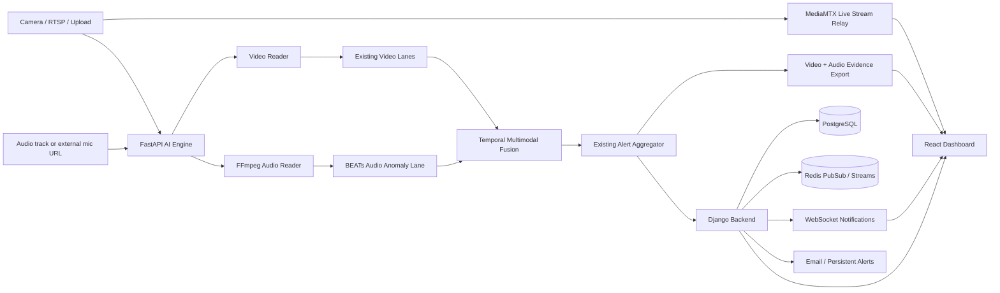
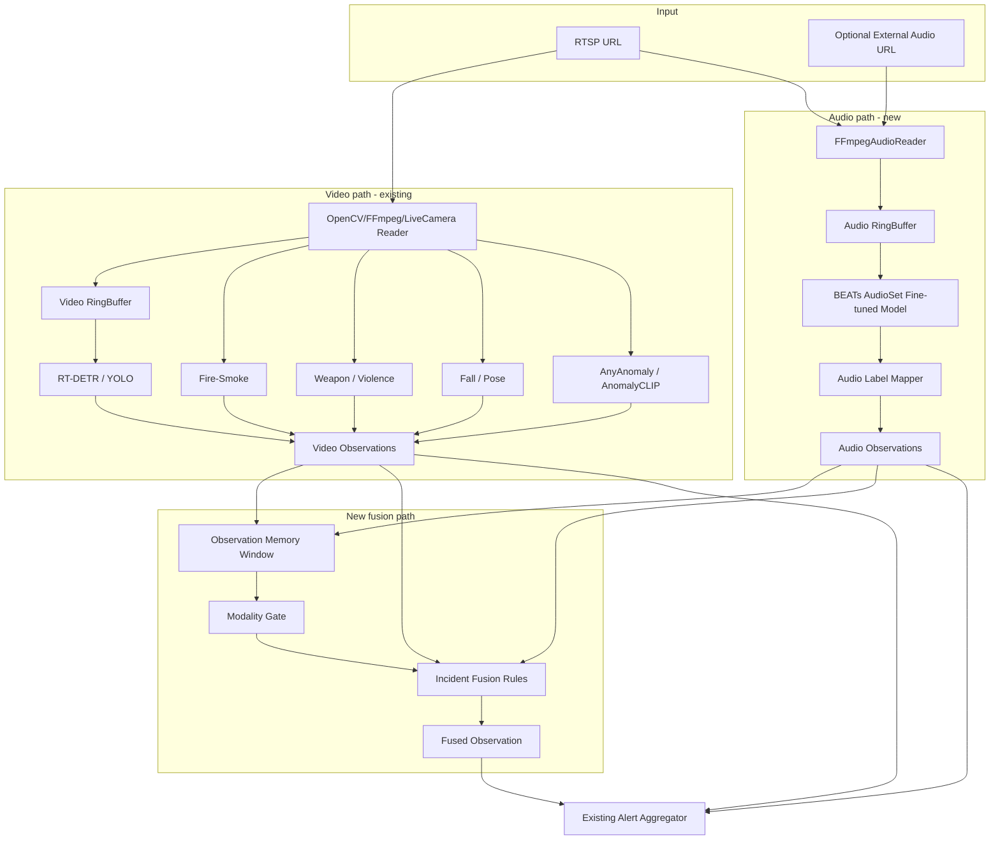
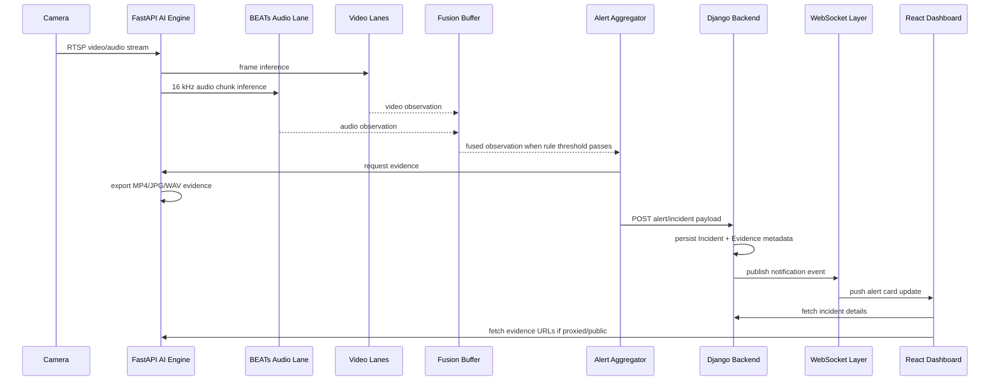
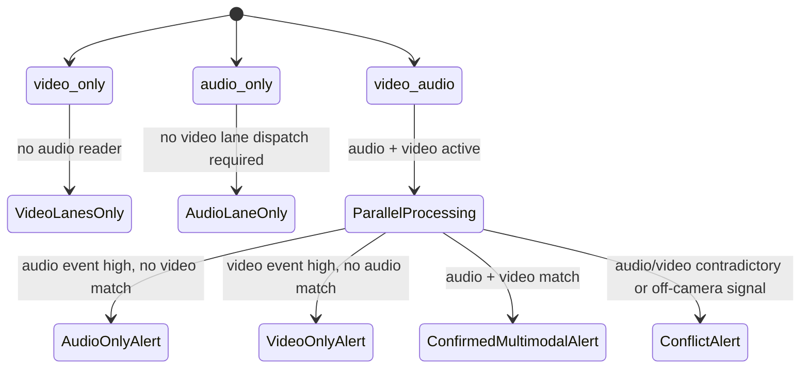
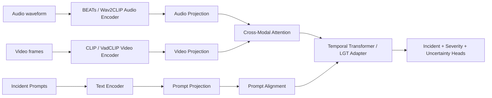

# VigilZone / 295A SOTA Audio-Visual Architecture, Novelty, and Report Information

**Date:** 2026-05-09  
**Repository target:** `https://github.com/KasplatSnow/295A`  
**Purpose:** This file is for report modification, project explanation, architecture justification, novelty discussion, and model-novelty wording. It intentionally avoids low-level coding-agent implementation details.

**Do not use this file as the coding-agent task list.** The companion implementation file is:

```text
VIGILZONE_SOTA_IMPLEMENTATION_PLAN_FOR_CODING_AGENT.md
```

**Core claim:** VigilZone is a SOTA-aligned, deployment-ready multimodal anomaly detection platform. The project does not claim to invent BEATs, CLIP, AVadCLIP, or MAVAD. Its novelty is adapting strong audio/video models and multimodal fusion ideas into an end-to-end real-time community-surveillance system with incident management, evidence, dashboard review, and notifications.

---
## 1. Executive Decision

The best practical SOTA-aligned plan for VigilZone/295A is:

```text
Phase 1, implement now:
Existing video lanes
+ BEATs AudioSet fine-tuned audio event recognition
+ temporal smoothing
+ audio-only/video-only/video-audio modes
+ rule/score-level multimodal fusion
+ event-conflict reasoning
+ audio/video evidence capture
+ backend incident integration
+ frontend audio/multimodal display
+ WebSocket/email/persistent notifications

Phase 2, implement after Phase 1 is green:
BEATs embeddings
+ per-camera normality profiles
+ uncertainty-aware adaptive gating
+ lightweight learned fusion head

Phase 3, research upgrade:
AVadCLIP/MAVAD-style cross-modal attention
+ prompt learning
+ missing-modality robustness
+ weakly supervised training/evaluation on anomaly datasets
```

### Why this is the right plan

The existing repo already has a production-like architecture: React UI, Django backend, FastAPI AI engine, PostgreSQL, Redis, and MediaMTX. It also already includes video AI functions such as fire/smoke, weapon/violence, pose/fall, identity, zones/intrusion, AnyAnomaly, AnomalyCLIP, WebRTC relay, and real-time notifications. Therefore, the fastest high-value change is not to replace the system; it is to add audio and multimodal fusion around the existing working pipeline.

BEATs is the correct Phase 1 audio backbone because it is PyTorch-based, has official pretrained/fine-tuned checkpoints, and reported strong SOTA results at publication time. The paper reports 50.6% mAP on AudioSet-2M and 98.1% accuracy on ESC-50, and the official Microsoft UniLM repo provides pretrained and AudioSet fine-tuned BEATs checkpoints.

AVadCLIP and MAVAD/AVACA are important references for the SOTA direction, but they should not be treated as simple plug-ins for a live RTSP community-surveillance app. AVadCLIP's official repo uses extracted CLIP/Wav2CLIP features and released pretrained models for XD-Violence due licensing constraints, so it is better as a Phase 3 research upgrade.

---

## 2. Current 295A Architecture Fit

### 2.1 Current system capabilities

The current project already has:

- React/Vite frontend.
- Django backend with REST and WebSocket support.
- AI Engine using FastAPI and computer vision.
- PostgreSQL as the main database.
- Redis for streams/pubsub.
- MediaMTX for live streaming.
- Existing real-time video lanes for fire/smoke, weapons/violence, falls, identity, smart zones/intrusion, AnyAnomaly, and AnomalyCLIP.
- Existing live WebRTC/RTSP relay.
- Existing real-time dashboard notifications and email/persistent alerting.

### 2.2 Current gap

The AI processor is currently video-frame-first. The process loop obtains a frame and timestamp:

```python
frame, ts = self.reader.get_latest()
```

It then sends video frames to lanes:

```python
lane.infer(frame, ts, **lane_kwargs)
```

This means **audio-only** and **audio-video** modes are not drop-in. The project needs a parallel audio reader, audio buffer, audio lane, and fusion logic.

### 2.3 Fit verdict

| Mode | Current fit | Required change |
|---|---:|---|
| `video_only` | Already fits | Keep existing lanes working |
| `audio_only` | Does not fit | Add audio reader, audio lane, backend/frontend support |
| `video_audio` | Partially fits | Add synchronized fusion path and evidence |

---

## 3. SOTA Alignment Matrix

| SOTA feature | Phase 1 status | Phase 2 status | Phase 3 status |
|---|---:|---:|---:|
| Strong pretrained audio backbone | BEATs fine-tuned checkpoint | BEATs embedding/prototype profile | Possible BEATs/Wav2CLIP comparison |
| CLIP-style video semantics | Use existing AnomalyCLIP/AnyAnomaly/video lanes | Add unified video embedding output | AVadCLIP/VadCLIP-style training |
| Temporal reasoning | Sliding-window smoothing | Temporal feature memory | Temporal transformer/adapter |
| Multimodal fusion | Score/rule-level fusion | Learned gated fusion | Cross-modal attention |
| Event conflict reasoning | Yes | Yes | Yes |
| Missing modality support | Rule fallback | Uncertainty-aware fallback | Distillation-style robustness |
| Per-camera adaptation | Config thresholds | Normality profile | Continual/few-shot adaptation |
| Explainability | Fusion reason string | Top contributing evidence | Prompt-aligned evidence explanations |
| Production deployment | Yes | Yes | Maybe after optimization |

---

## 4. Target Architecture Diagrams

### 4.1 Full platform architecture



### 4.2 AI engine runtime architecture



### 4.3 Alert sequence



### 4.4 Modality mode state diagram



---

## Report-Focused Component Summary

This section is for report writing only. It summarizes the implementation components without giving the coding agent low-level code instructions.

| Layer | Current role | SOTA-aligned change | Report significance |
|---|---|---|---|
| AI service | Runs video-frame-first inference lanes | Adds BEATs audio lane, audio reader, audio ring buffer, temporal multimodal fusion, and audio evidence export | Converts the system from video-only/video-first detection to multimodal incident reasoning |
| Backend | Stores cameras, incidents, alerts, user preferences, and notification data | Adds modality configuration, audio-enabled camera fields, audio/fusion incident payload support, and notification preference wiring | Makes multimodal detection operational rather than only a model demo |
| Frontend | Displays camera streams, incidents, alerts, and dashboard state | Adds modality selection, audio detection controls, multimodal alert badges, fusion explanations, and audio evidence playback | Lets users understand why an incident was raised and review audio/video evidence together |
| Notifications | Sends realtime and persistent alerts | Adds modality-aware alert messages and user audio-alert preferences | Prevents audio alerts from bypassing user control and improves explainability |
| Deployment | Runs the existing Dockerized services | Adds FFmpeg audio extraction, BEATs checkpoints in a mounted model volume, model verification, and health checks | Keeps the SOTA-aligned design practical for local/demo/cloud deployment |

The implementation intentionally avoids replacing the existing working video stack. The SOTA-aligned contribution is the added multimodal layer: strong BEATs audio features, existing video anomaly/object/action signals, temporal reasoning, configurable modality modes, event-conflict handling, evidence capture, and end-to-end incident delivery.

---

## 5. Model Strategy

## 5.1 Audio model: BEATs

### Selected production model

Use **Microsoft BEATs** from the official UniLM BEATs repository.

Repository:

```text
https://github.com/microsoft/unilm/tree/master/beats
```

Primary checkpoint for accuracy-first single model:

```text
Fine-tuned BEATs_iter3+ (AS2M) (cpt2)
```

Secondary checkpoint for ensemble accuracy mode:

```text
Fine-tuned BEATs_iter3+ (AS2M) (cpt1)
```

Recommended default:

```text
Cost-effective deployment:
    use Fine-tuned BEATs_iter3+ (AS2M) (cpt2) only

Accuracy-first deployment:
    load Fine-tuned BEATs_iter3+ (AS2M) (cpt1)
    load Fine-tuned BEATs_iter3+ (AS2M) (cpt2)
    average probabilities
```

### Why BEATs

- It is PyTorch-based, matching the existing AI stack.
- It has official pretrained and AudioSet fine-tuned checkpoints.
- It reported SOTA results at publication time across audio classification benchmarks.
- It can produce broad AudioSet-style audio event probabilities.
- It avoids adding TensorFlow/TensorFlow Hub to the AI container.

### Do not do this

Do **not** hardcode:

```python
NUM_LABELS = 527
```

Instead:

```python
label_dict = checkpoint["label_dict"]
num_labels = len(label_dict)
```

### BEATs model directory layout

Create this directory layout in the repo or mounted model volume:

```text
services/ai/models/audio/beats/
    README.md
    BEATs_iter3_plus_AS2M_finetuned_cpt2.pt
    BEATs_iter3_plus_AS2M_finetuned_cpt1.pt    # optional ensemble
```

Create this source directory:

```text
services/ai/third_party/beats/
    BEATs.py
    Tokenizers.py
    __init__.py
    LICENSE_OR_NOTICE.md
```

The coding agent must copy only the minimal BEATs source files required to instantiate `BEATs` and `BEATsConfig`, plus license/notice text. If the project policy prefers submodules, use a git submodule instead, but the runtime import path must still work inside the Docker container.

### BEATs loading contract

The model loader must follow the official API pattern:

```python
import torch
from BEATs import BEATs, BEATsConfig

checkpoint = torch.load(model_path, map_location=device)
cfg = BEATsConfig(checkpoint["cfg"])
model = BEATs(cfg)
model.load_state_dict(checkpoint["model"])
model.eval()
label_dict = checkpoint.get("label_dict", {})
```

Fine-tuned checkpoint inference:

```python
probs = model.extract_features(audio_input_16khz, padding_mask=padding_mask)[0]
```

`audio_input_16khz` must be:

```text
shape: [batch, samples]
dtype: torch.float32
range: approximately [-1.0, 1.0]
sample rate: 16000 Hz
channels: mono
```

### Audio events that should map to product labels

Create canonical product labels independent of raw AudioSet wording:

```text
audio_scream
audio_shout
audio_gunshot
audio_explosion
audio_glass_break
audio_siren
audio_alarm
audio_vehicle_crash
audio_footsteps
audio_dog_bark
audio_unknown_anomaly
```

Raw BEATs labels must map to canonical labels through `audio_label_mapper.py`.

Example mapping:

```python
AUDIOSET_TO_PRODUCT_LABELS = {
    "Screaming": "audio_scream",
    "Scream": "audio_scream",
    "Shout": "audio_shout",
    "Yell": "audio_shout",
    "Gunshot, gunfire": "audio_gunshot",
    "Explosion": "audio_explosion",
    "Glass": "audio_glass_break",
    "Breaking": "audio_glass_break",
    "Siren": "audio_siren",
    "Alarm": "audio_alarm",
    "Vehicle horn, car horn, honking": "audio_vehicle_noise",
    "Tire squeal": "audio_vehicle_crash",
    "Crash cymbal": None,  # do not confuse musical crash with vehicle crash
    "Footsteps": "audio_footsteps",
    "Dog": "audio_dog_bark",
}
```

The mapper must support substring matching but must include negative guardrails for labels that are semantically misleading.

---

## 5.2 Video model strategy

### Phase 1 video path

Do not replace existing video lanes. Use:

```text
rt_detr
yolov8_fallback
fire_smoke_yolo
weapon_yolo
violence_candidate
fall_candidate
accident
anyanomaly
anomalyclip
person_zone / intrusion logic if already configured
```

The video path already works. The audio upgrade should consume the existing video observations.

### Phase 2 video feature path

Add a standard optional interface to expose a video embedding or semantic observation from existing anomaly lanes:

```python
class VideoSemanticObservation(TypedDict):
    camera_id: str
    ts_utc: str
    lane: str
    label: str
    score: float
    embedding: Optional[List[float]]
    bbox: Optional[List[float]]
    debug: Dict[str, Any]
```

Do not require this interface for Phase 1.

### Phase 3 research path

Optional future integration:

```text
VadCLIP-style weakly supervised video anomaly detection
AVadCLIP-style audio-visual collaboration
MAVAD/AVACA-style cross-modal attention
```

Phase 3 requires dataset/evaluation work and should not block the production demo.

---

## 5.3 Fusion model strategy

### Phase 1 fusion: deterministic score/rule fusion

Use temporal windows and confidence thresholds. Do not train a neural fusion model in Phase 1.

Inputs:

```text
last 10 seconds audio observations
last 10 seconds video observations
camera context
modality mode
sensor health
```

Outputs:

```text
synthetic Observation with lane="video_audio_fusion"
incident_type
incident_label
score
severity
fusion_reason
audio_evidence
video_evidence
```

### Phase 1 formula

Compute modality reliability:

```python
audio_quality = clamp01(1.0 - audio_uncertainty)
video_quality = clamp01(1.0 - video_uncertainty)
```

Use configured base weights:

```python
base_audio_weight = config.audio_weight  # default 0.45
base_video_weight = config.video_weight  # default 0.55
```

Normalize:

```python
audio_weight = base_audio_weight * audio_quality
video_weight = base_video_weight * video_quality
norm = max(audio_weight + video_weight, 1e-6)
audio_weight /= norm
video_weight /= norm
```

Fusion score:

```python
fusion_score = audio_weight * audio_score + video_weight * video_score + synergy_bonus - conflict_penalty
fusion_score = clamp01(fusion_score)
```

Suggested defaults:

```yaml
fusion:
  window_s: 10.0
  audio_weight: 0.45
  video_weight: 0.55
  synergy_bonus_confirmed: 0.12
  conflict_penalty: 0.10
  fused_alert_threshold: 0.72
  high_severity_threshold: 0.85
```

### Phase 1 incident rules

#### Rule A: scream + person/fall/running/fight

```text
IF audio_scream score >= 0.70
AND video observation in {person, fall, violence, fight, running, intrusion} score >= 0.50
within +/- 5 seconds
THEN incident_type = multimodal_anomaly or violence
severity = high
fusion_reason = "scream audio plus suspicious person/video activity"
```

#### Rule B: gunshot/explosion audio

```text
IF audio_gunshot score >= 0.80 OR audio_explosion score >= 0.80
THEN emit audio-only high-risk incident even without video confirmation
IF matching video observation appears within window
THEN upgrade to confirmed multimodal incident
```

#### Rule C: glass break + intrusion/zone/person

```text
IF audio_glass_break score >= 0.65
AND video observation in {intrusion, person_zone, person, unknown_person} >= 0.50
THEN incident_type = intrusion
severity = high
```

#### Rule D: alarm/siren + fire/smoke

```text
IF audio_alarm OR audio_siren score >= 0.70
AND video fire/smoke score >= 0.50
THEN incident_type = fire
severity = high
```

#### Rule E: audio-only off-camera event

```text
IF high-confidence dangerous audio exists
AND no relevant video observation exists
THEN incident_type = audio_anomaly
severity = medium or high depending on label
fusion_reason = "dangerous audio detected without visual confirmation; possible off-camera event"
```

#### Rule F: video-only event

```text
IF existing video lane already triggers
AND no audio exists or audio disabled
THEN keep original video alert behavior unchanged
```

#### Rule G: community-noise suppression

```text
IF audio label is non-dangerous community noise
AND no suspicious video exists
THEN do not alert
```

Examples of suppressible community noise:

```text
normal speech
music
traffic hum
engine idling
wind
rain
crowd murmur
```

---

## 13. Novelty Statement

Use this in the report/paper:

> VigilZone's novelty is a deployment-oriented multimodal anomaly detection architecture for community surveillance. Instead of focusing only on a single benchmark model, the system combines real-time video detection, BEATs-based audio event recognition, configurable audio-only/video-only/audio-video operation, temporal fusion, event-conflict reasoning, evidence capture, incident management, and dashboard/notification delivery. The model contribution is SOTA-aligned rather than a claim of standalone benchmark SOTA: it adapts strong audio and vision foundation models into a practical uncertainty-aware audio-visual incident reasoning system.

---

## 14. What is Novel in the System

### 14.1 Configurable modality modes

The system can run in:

```text
video_only
audio_only
video_audio
```

This matters because real deployments often have incomplete sensors:

- Some cameras have no microphone.
- Some locations should not store audio.
- Some cameras are visually occluded but audio still works.
- Some audio tracks are noisy and should be deweighted.

### 14.2 Incident-level fusion instead of model-only output

Many research systems output an anomaly score. VigilZone converts model outputs into operational incidents:

```text
model prediction -> temporal evidence -> fusion reason -> incident -> evidence -> notification -> dashboard review
```

### 14.3 Event conflict reasoning

The system explicitly handles:

```text
audio confirms video
audio contradicts video
audio detects off-camera event
video detects silent visual event
```

Examples:

```text
Scream + no visible person = possible off-camera emergency
Glass break + person in zone = likely intrusion
Fire alarm + smoke = confirmed fire risk
Gunshot + no video match = high-risk audio-only event
Traffic noise + no suspicious video = suppress
```

### 14.4 Privacy-aware evidence

The system does not require continuous audio recording. It supports:

```text
event clips only
metadata only
disabled
```

### 14.5 Product integration

The project includes live streaming, backend persistence, WebSocket notifications, frontend incident review, and evidence management. This is more deployment-oriented than a standalone notebook/model demo.

---

## 15. What is Novel in the Model

BEATs itself should not be claimed as novel; it is an existing model.

The model novelty is the **adaptation and fusion layer**:

```text
BEATs audio event probabilities
+ existing video anomaly/object/action observations
+ temporal memory
+ modality reliability weighting
+ event-specific fusion rules
+ conflict/off-camera reasoning
+ optional per-camera normality profiles
= deployment-ready audio-visual incident model
```

### 15.1 Phase 1 model novelty

```text
SOTA-grade BEATs audio backbone
+ existing semantic video lanes
+ temporal smoothing
+ deterministic multimodal incident fusion
+ explainable fusion reasons
```

### 15.2 Phase 2 model novelty

```text
BEATs embedding normality profile per camera
+ uncertainty-aware gating
+ learned lightweight fusion head
+ sensor health aware scoring
```

### 15.3 Phase 3 model novelty

```text
AVadCLIP/MAVAD-inspired cross-modal attention
+ prompt learning
+ missing-modality robustness
+ weakly supervised anomaly training
```

---

## 16. Phase 2 Learned Fusion Design

This is a future extension after the deployable Phase 1 system is validated.

### 16.1 Feature vector

For each event window, build:

```python
features = {
    "audio_scores": {
        "audio_scream": float,
        "audio_gunshot": float,
        "audio_glass_break": float,
        "audio_alarm": float,
        "audio_explosion": float,
    },
    "video_scores": {
        "person": float,
        "intrusion": float,
        "fall": float,
        "violence": float,
        "weapon": float,
        "fire": float,
        "smoke": float,
    },
    "quality": {
        "audio_uncertainty": float,
        "video_uncertainty": float,
        "audio_snr": float,
        "video_brightness": float,
    },
    "context": {
        "hour_of_day": int,
        "camera_profile_id": int,
        "is_night": bool,
    }
}
```

Flatten to vector.

### 16.2 Lightweight fusion model

Use a tiny MLP:

```python
class LightweightFusionHead(nn.Module):
    def __init__(self, input_dim: int, num_incident_types: int):
        super().__init__()
        self.net = nn.Sequential(
            nn.Linear(input_dim, 128),
            nn.ReLU(),
            nn.Dropout(0.1),
            nn.Linear(128, 64),
            nn.ReLU(),
        )
        self.incident_head = nn.Linear(64, num_incident_types)
        self.severity_head = nn.Linear(64, 1)
        self.uncertainty_head = nn.Linear(64, 1)

    def forward(self, x):
        h = self.net(x)
        return {
            "incident_logits": self.incident_head(h),
            "severity": torch.sigmoid(self.severity_head(h)),
            "uncertainty": torch.sigmoid(self.uncertainty_head(h)),
        }
```

### 16.3 Training data

Start with weak labels from historical incidents:

```text
positive windows: +/- 10 seconds around confirmed incident
negative windows: calm periods with no incidents
```

Do not train on unreviewed false positives as truth.

### 16.4 Deployment safety

Even with learned fusion, keep rule-based fusion as fallback:

```yaml
fusion:
  mode: hybrid
  learned_model_enabled: false initially
  rule_fallback_enabled: true
```

---

## 17. Phase 3 Research Architecture

This is optional and should not block the product implementation.



### 17.1 Prompt bank

```text
normal community scene
person screaming in distress
gunshot or explosion near camera
glass breaking during intrusion
person falling or injured
violent fight or physical assault
fire or smoke emergency
vehicle crash or impact
```

### 17.2 Missing modality robustness

If audio missing:

```text
use video-only branch + uncertainty estimate
```

If video missing:

```text
use audio-only branch + uncertainty estimate
```

If both present:

```text
use cross-modal branch
```

---

## 22. Source Notes for Report

Use these references in the written report:

1. VigilZone/295A repository architecture and features:  
   `https://github.com/KasplatSnow/295A`

2. Current AI processor frame-first dispatch:  
   `https://github.com/KasplatSnow/295A/blob/main/services/ai/src/app.py`

3. BEATs paper:  
   `https://proceedings.mlr.press/v202/chen23ag.html`

4. BEATs official implementation and checkpoints:  
   `https://github.com/microsoft/unilm/tree/master/beats`

5. AVadCLIP official implementation:  
   `https://github.com/WanshunSu/AVadCLIP`

6. VadCLIP official implementation:  
   `https://github.com/nwpu-zxr/VadCLIP`

7. MAVAD/AVACA paper:  
   `https://arxiv.org/abs/2305.15084`

---

## 23. Recommended Wording for Final Report

### 23.1 Contribution summary

> This work extends VigilZone from a video-first community surveillance system into a SOTA-aligned multimodal anomaly detection platform. The system integrates BEATs-based audio event recognition with existing real-time video anomaly lanes and adds temporal audio-video fusion, event-conflict reasoning, evidence export, backend incident mapping, dashboard visualization, and notification delivery. The contribution is not a new audio foundation model; it is a deployable architecture that adapts strong audio and vision models into a real-time safety workflow.

### 23.2 Model novelty statement

> The model novelty lies in the multimodal incident reasoning layer. BEATs provides high-quality audio event probabilities, while the existing video lanes provide object, action, anomaly, and scene-level evidence. VigilZone combines these signals using temporal windows, modality reliability, event-specific fusion rules, conflict detection, and optional per-camera normality profiles. This gives the system robust audio-only, video-only, and audio-video behavior while reducing false positives through multimodal confirmation.

### 23.3 SOTA-aligned but honest claim

> The proposed model is SOTA-aligned rather than a claim of benchmark SOTA. It uses SOTA-grade pretrained audio representation learning through BEATs and follows recent audio-visual anomaly detection directions such as cross-modal fusion, prompt-based reasoning, and missing-modality robustness. The initial implementation prioritizes deployability and reliability; later phases can introduce AVadCLIP/MAVAD-style learned fusion and weakly supervised training.

---

## 24. Final Implementation Target

After all Phase 1 changes, a user should be able to:

1. Open the dashboard.
2. Add or edit a camera.
3. Select `Video + audio` mode.
4. Enable BEATs audio anomaly detection.
5. Save the camera.
6. See the AI service start both video and audio processing.
7. Trigger a sound event such as scream/glass break/gunshot test audio.
8. See an alert card with audio or audio-video modality badges.
9. Open incident details.
10. Play the saved WAV audio evidence.
11. View fusion reason, top BEATs labels, video evidence, score, and severity.
12. Receive WebSocket/email/persistent notification if preferences allow it.

That is the deployment-ready SOTA-aligned outcome.
